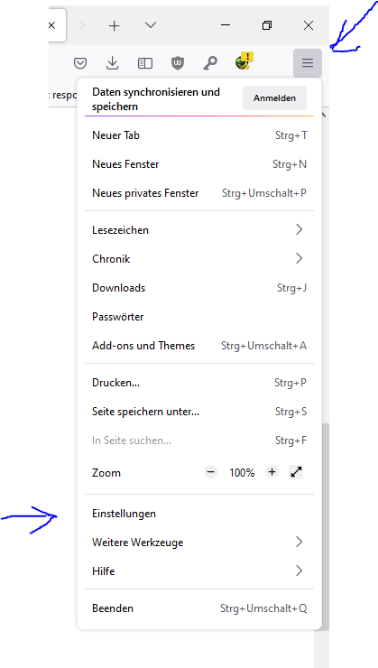

# Auto Print

[](https://opensource.org/licenses/MIT)
[](https://github.com/pre-commit/pre-commit)
[](https://github.com/astral-sh/ruff)
[](https://codecov.io/gh/philipp-horstenkamp/auto_print)
[](https://github.com/philipp-horstenkamp/auto_print/actions/workflows/ci.yml)

### Installation

#### Windows MSI Installer (Recommended)

1. Download the latest MSI installer from the [releases page](https://github.com/philipp-horstenkamp/auto_print/releases).
2. Double-click the downloaded .msi file to start the installation wizard.
3. Follow the on-screen instructions to complete the installation.

The MSI installer will:
- Install the auto-print application for all users
- Add the installation directory to the system PATH
- Create a shortcut for the configuration tool in the Start Menu
- Add a context menu entry for PDF files (right-click on PDF files to see the "Auto Print with Auto Print" option)

#### From Source

1. Clone the repository:
   ```
   git clone https://github.com/philipp-horstenkamp/auto_print.git
   cd auto_print
   ```

2. Install Poetry (dependency management tool):
   ```
   pip install pipx
   pipx install poetry
   ```

3. Install dependencies and build the package:
   ```
   poetry install
   ```

4. Run the application directly with Poetry:
   ```
   poetry run python -m auto_print.auto_print_execute <file_path>
   poetry run python -m auto_print.auto_print_config_generator
   ```

5. Alternatively, build a wheel package:
   ```
   poetry build
   ```

   The wheel file will be available in the `dist` directory and can be installed with pip:
   ```
   pip install dist/*.whl
   ```

6. For creating an MSI installer:
   ```
   poetry install --only main,build
   poetry run python msi_setup.py bdist_msi
   ```

   The MSI installer will be available in the `dist` directory.

### Uninstallation

#### Uninstalling MSI Installation

To uninstall the auto-print application that was installed using the MSI installer:

1. Open the Windows Control Panel
2. Go to "Programs and Features" or "Apps & features" (depending on your Windows version)
3. Find "auto-print" in the list of installed programs
4. Select it and click "Uninstall" or "Remove"
5. Follow the on-screen instructions to complete the uninstallation

The uninstaller will automatically remove all files, shortcuts, and registry entries created during installation.

### Usage

#### Configuration

Run the configuration generator:

```
# If installed with pip or from wheel
auto-print-config

# If using Poetry
poetry run python -m auto_print.auto_print_config_generator
```

#### Processing Documents

To process a document:

```
# If installed with pip or from wheel
auto-print <file_path>

# If using Poetry
poetry run python -m auto_print.auto_print_execute <file_path>
```

## Integrate in the browser workflow
One of the use cases is to use this software as a default PDF executable from Firefox or Chrome:
Here some images on how to configure that:

1. Open the Settings Tab in your Browser as shown by the firefox browser:

2. Choose the auto-printer.exe as your default executable for pdf and all pdf like formats.


## Running the Configuration Generator

### Python Implementation
To run the configuration generator from the command line:

```
auto-print-config
```

Or if you're running from the source code:

```
python -m auto_print.auto_print_config_generator
```


## Main commands

| Command | Short | Result                                                    |
|:-------:|-------|:----------------------------------------------------------|
|  save   | s     | Save the configuration.                                   |
|  close  | c     | Closes the configuration generator.                       |
|   add   | a     | Add a new section to the configuration.                   | 
| delete  | d     | Delete a section from the configuration.                  |
|  show   | s     | Show the configuration in text form.                      |
| change  |       | Changes the section order.                                |
|  edit   | e     | Edits a section.                                          |
|  help   | h     | Show the help information.                                |
| repair  | r     | Repair the config file by checking if all printers exist. |


## Configuration example

The below file is an example with comments.
The file `TEST_something.pdf` would be printed with the first printer.
The file `Something_to_print.pdf` would be used by the second printer.
The file `ABC.docx` would be shown with MS Word (if installed).
```json
{
  "Marke": {
    "active": true,                 // Section active. Should be used.
    "printer": "MyPreciousPrinter",
    "prefix": "TEST_",              // How the file should start.
    "suffix": ".pdf",               // How the file should end.
    "print": true,                  // Prints the file.
    "show": false                   // Does not show the file.
  },
  "SomeOtherCategory": {
    "active": false,                // Section not active. Can't be used.
    "printer": "AnotherPrinter",
    "prefix": "Something",
    "suffix": ".pdf",
    "show": true,                   // Printing via default windows application
    "print": true
  },
  "UseDefaultPrinter": {
    "active": true,
                                    //no printer is given therefore the default printer is used."
    "prefix": "DefPrintFile",
    "suffix": ".pdf",
    "show": false,
    "print": true
  },
  "All": {                          // Default action (No requirements)
    "active": true,               
    "show": true,                   // Show without printing (Windows Default action)
    "print": false
  }
}
```


## Software dependencies
To use the software effectively, the following programs are needed:

- [Ghostscript](https://www.ghostscript.com/releases/gsdnld.html)
- [Adobe PDF Reader](https://www.adobe.com/de/acrobat/pdf-reader.html)

## How it works 

The goal of this project is to simplify the tedious task or printing similar forms.

1. The program is started with a filepath as an argument.
2. The filename gets extracted.
3. The filename is compared to a list of suffixes and prefixes.
4. If suffix and prefix are a match, the file gets executed.
If a suffix or a prefix is not given, the comparison is true either way.
5. The file is then either Printed and/or shown depending on the configuration.

Everything is logged and can be locked up in the auto_print.log file!

## About

This project was originally written in Python by Philipp Horstenkamp in the hope 
that it will make some office processes a bit smoother.

## License

This project is licensed under the MIT License.
