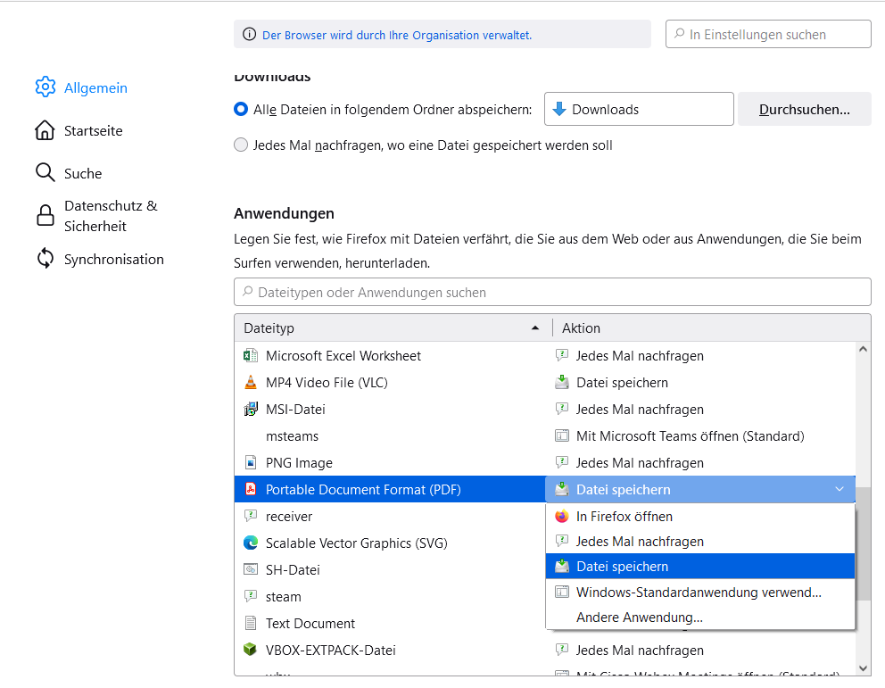

# Auto Print

<!--TOC-->

- [Auto Print](#auto-print)
  - [Features](#features)
  - [Integrate in browser workflow](#integrate-in-browser-workflow)
  - [Configuration example](#configuration-example)
  - [Systemvoraussetzungen](#systemvoraussetzungen)
  - [Further improvements](#further-improvements)

<!--TOC-->
## Features

The goal of this project is to simplify the tedious task or printing similar forms.

1. The program is started with a filepath as an argument.
2. The filename gets extracted.
3. The filename is compared to a list of suffixes and prefixes.
4. If suffix and prefix are a match the file gets executed.
If a suffix or a prefix is not given the comparison is true either way.
5. The file is then eiter Printed and/or shown depending on the configuration.

Everything is logged and can be locked up in the auto_print.log file!

To test this software while setting up there is a `test_print.bat`.
Hit it for easy testing.

One of the use cases is to use this software as a default PDF executable from Firefox or Chrome:
Here some images on how to configure that:

## Integrate in browser workflow
1. Open the Settings Tab in your Browser:

2. Choose the auto-printer.exe as your default executable for pdf and all pdf like formats.


## Configuration example

The below file is an example with comments.
The file `TEST_something.pdf` would be printed with the first printer.
The file `Something_to_print.pdf` would be used by the second printer.
The file `ABC.docx` would be shown with MS Word (if installed).
```json
{
  "Marke": {
    "active": true,                 // Section active. Should be used.
    "printer": "MyPreciousPrinter",
    "prefix": "TEST_",             // How the file should start.
    "suffix": ".pdf",              // How the file should end.
    "print": true,                 // Prints the file.
    "show": false                  // Does not show the file.
  },
  "SomeOtherCategory": {
    "active": false,               // Section not active. Can't be used.
    "printer": "AnotherPrinter",
    "prefix": "Something",
    "suffix": ".pdf",
    "show": true,                  // Printing via default windows application
    "print": true
  },
  "UseDefaultPrinter": {
    "active": true,
                                   //no printer is given therefore the default printer is used."
    "prefix": "DefPrintFile",
    "suffix": ".pdf",
    "show": false,
    "print": true
  },
  "All": {                         // Default action (No requirements)
    "active": true,               
    "show": true,                  // Show without printing (Windows Default action)
    "print": false
  }
}
```

## Systemvoraussetzungen
Um die Software gut nutzen zu können werden folgende Programme benötigt:

- [Ghostscript](https://www.ghostscript.com/releases/gsdnld.html)
- [Adobe PDF Reader](https://www.adobe.com/de/acrobat/pdf-reader.html)


## Further improvements

- [ ] A config file checker that checks 
if all the used printers exist for this application.
- [ ] A way to force the printer to print in grayscale.
